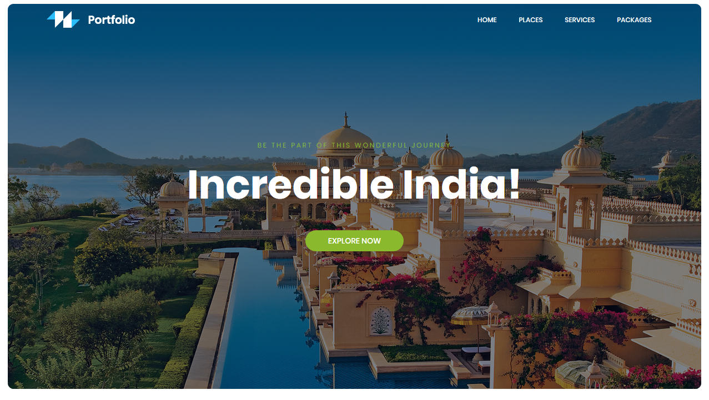
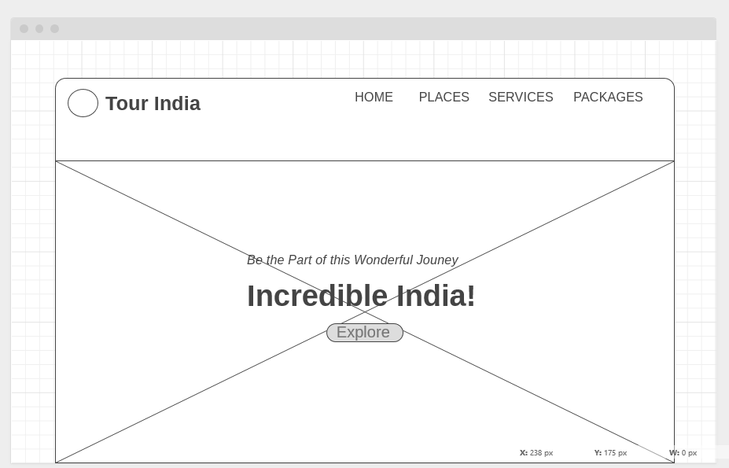

<<<<<<< HEAD
# tourindia-master--1
An interactive tourism portal with destination details, image gallery, and contact form for travelers . Tourism and travel website designed to promote beautiful destinations and make trip planning easier.
=======

	
	<h4>A simple Tourism Website Portfolio which shows travel destinations across various part of Country. This theme is made using Bootstrap features several content sections, a responsive portfolio grid (tourist-places), window modals for each portfolio item, Blogs section and AboutUs Section</h4>

## [Live Preview](https://mrjatinchauhan.github.io/tourindia/)

## Wireframe

## Usage
After downloading, simply edit the HTML and CSS files included with the template in a code editor to make changes. These are the only files you need to worry about, you can ignore everything else! To preview the changes you make to the code, you can open the `index.html` file in your web browser.
>>>>>>> 835f803 (Initial commit: Add all project files)
